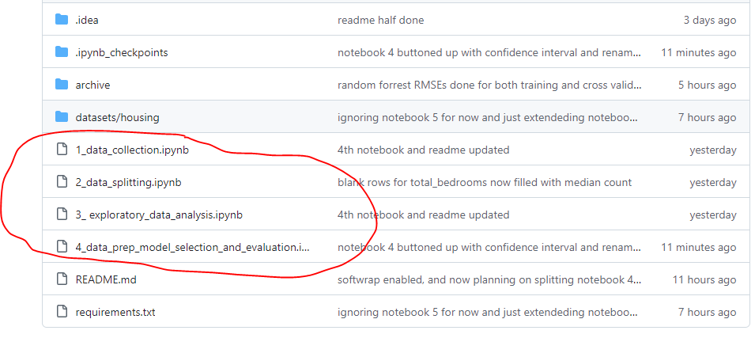
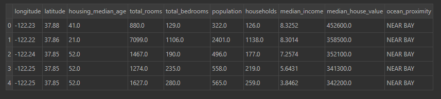
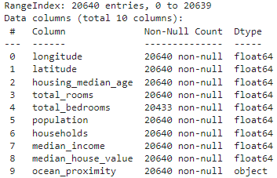
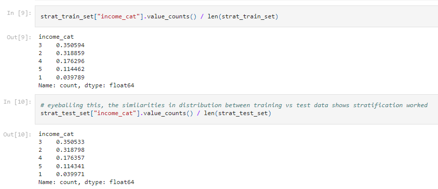
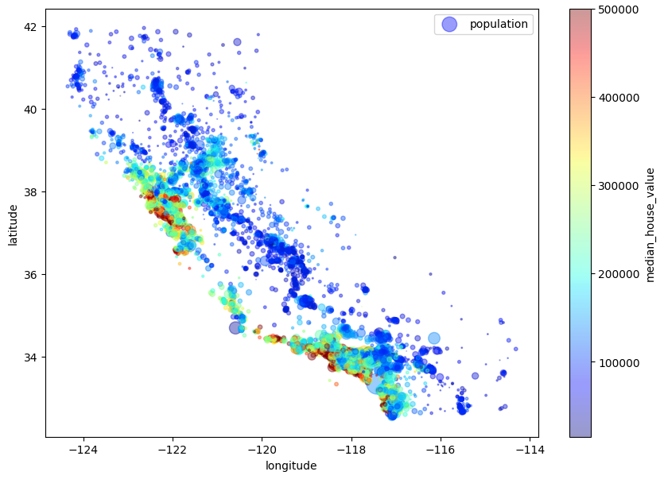
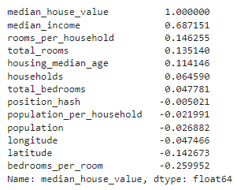
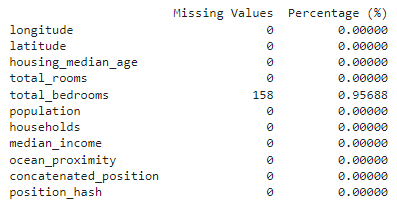
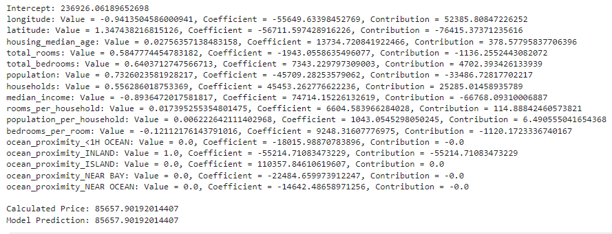
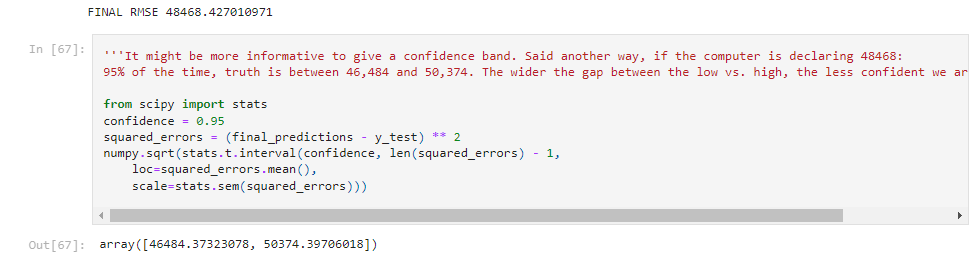

# Housing Price Predictor

## Author's context:
I've built out 3 basic CRUD web apps with databases, but this was <ins>__my first AI/ML project__</ins>.

This is a classic ML/supervised learning exercise where I find optimal methods for predicting housing prices. An ex-Google dev showed me an industry standard book:
[Hands-On Machine Learning with Scikit-Learn, Keras, and TensorFlow](https://www.amazon.com/Hands-Machine-Learning-Scikit-Learn-TensorFlow/dp/1492032646) by Aurelien Geron. Knowing what I know now, I don't think this was a beginner-friendly book.

I tried this project 8 weeks ago, but skipped over certain parts, did them correctly, or did them without a complete understanding of the rationale. Feeling a lot better with this V2.

## What I built:
Findings are presented in <ins>__chronologically-numbered Jupyter notebooks__</ins> aand intended to be viewed on GitHub as a standalone i.e. no need to download/run anything.

    ### 1. Data Collection:
  - Leans on existing, but imperfect, dataset from the public web
  - Gets quick overview of data types, basic stats

  ### 2. Data Splitting:
  - Creates stable roots of hash values to avoid inconsistencies of refreshes/re-imports
  - Upgrades random sampling with stratified sampling (based on median income)

  ### 3. EDA (Exploratory Data Analysis):
  - Geographic mapping, with opacity -> data density and color -> density population
  - Correlation matrix for numeric dimensions only
  - Scatter matrix
  - Experiment on 3 new KPIs e.g. "rooms per household"

  ### 4. Data Preparation & Model Training & Evaluation:
  - Data Cleaning e.g. filling in blank rows
  - Encoding (non-numerical dimensions e.g. ocean proximity)
  - Custom Transformation (repeatable way of adding additional dimensions like bedrooms:rooms ratio)
  - Feature Scaling (chose Standardization)
  - Per textbook, I sampled only 3 common methods and then measured accuracy with RSME:
    - Linear Regression
    - Decision Tree Regression
    - Random Forest Regression
  - Cross validation, which is kind of like a tournament of the 3 players (competing models) involved 
  - Fine-tuning
  - Custom Pipelines
  - Machine Learning to test out different settings

  ### Conclusion:
  - This was a neat project in the sense that I finally used Machine Learning, but I was a little disappointed by big the RMSE was. It offered some value, but not as clean of predictive value as I was expecting. 

## New technical achievements:
>**Jupyter**
Up until now, I have only used Pycharm to print out statements to test my code. This is an interactive code-testing tool that lets me see results faster.

>**Pandas**
Since I got my start on LeetCode, my original training forced me to use only the core Python functions for solving problems, and I never used libraries like NumPy or Pandas to do calculations. Now I see that Pandas is kind of like giving Python a path to SQL-like queries: "Group this data by X, then return Y description such as an average or a count". It let me convert CSV files into spreadsheets so I didn't have to keep making new tables in a Postgres database.

>**Matplotlib**
I had seen in a YouTube parody how Python can produce visuals, but I never knew how. This is the visualization tool.

>**Sci-kit Learn / SKLEARN**
I never heard of this tool, because I haven't touched anything related to data science or ML. This is the tool that holds the predictive models like Linear Regression, Decision Tree, and Random Forest

>**NumPy**
Heard of this many times during my LeetCode days, but never touched it because it would be cheating during an interview. Just used it to produce a stratified sampling (by median household income), followed by first histogram

>**SciPy**
Never heard of this before, but just used it convert string data in the ocean proximity dimension into multiple columns i.e. One-Hot Encoding

## Illustrative, but not comprehensive, screenshots:

## Learnings:
- There's a complementary tool "Hugging Face" I could use in future projects to host data, if viewers need more evidence beyond screenshots.
- Don't be surprised if your requirements.txt only lists 6 libraries, but your installation produces 20 packages. This is the result of a "dependency chain"
- Jupyter can be powerful because it allows you to see visual outputs (see later comment about matplot)
- When I got the section about splitting data into 2 sets, I learned that a function can return multiple outputs, so long as they are in tuples (not something you'd ever see on LeetCode)
- I always knew that tuples were like an immutable version of a list, but there was never a need to use them on LeetCode because the memory savings wasn't worth the trouble. Now I see that tuples, because they are locked-in, could be used as a dictionary key, which might have impacted my strategy for solving the DSA question in my first technical interview!
- In the famous Django tutorial by the University of Michigan professor, he mentions "42" as a survey answer. This tutorial asks us to pick "42" as an arbitrary seed value or random version number, cluing me in to engineering's inside-joke from that book "Hitchhiker's Guide to the Galaxy" 
- There's 2 ways we can randomly pull 80% of data and set it aside for training:
  - Method 1 is using latitude+longitude to make an non-random index ID, making it random via hash values, sorting by hash values, then taking the bottom 80% for training
  - Method 2 is using SciKit to skip ahead to the final step: randomly put 80% of the rows into the training bucket.
  - The point is that you need 1 or 2, but not both at same time.
- During stratified sampling, we set up "bins" just like in our Tableau days to divide districts by household income (bottom group 1 being < $15,000). Out of 20K districts, we found that ~4% were in group 1 income range, so the stratified sampling will ensure 4% of the training data prioritizes pulling random rows that are in that income range.
- When switching machines, I had to re-install 6 packages and I didn't know realize until that moment how large some of the libaries were, and how the internet can be so slow it gives timeout errors. Might be smart to prep devices before entering a cruise ship or a flight
- You can get the same randomized outcomes based on the seed value across multiple devices - it doesn't mean there was no randomness!
- I was surprised at how 95% of the time and effort was on data gathering and collection, just to get that juicy 5% of analysis and insight. If this wasn't a beginner project leveraging and existing dataset, it might have taken days or weeks just to build that data set of 20,000 rows and I'm not even sure how accurate and complete it would be. Reminds of how a finance team has a lot of bookkeepers and general ledger staff, but there's only 1 CFO gaining and communicating huge insights to the leadership team.

## Potential improvements:
>**Code structure:** 
- It was very cumbersome trying to re-use and modularize Pipeline code. If I was starting over from scratch, I might tuck that away in separate Python files outside the notebooks
- The offshoot to the above is that I was forced to jam 3 notebooks into the 4th and final notebook. Ideally, I would have had:
  - notebook 4 for data prep
  - notebook 5 for model selection and training
  - notebook 6 for model evaluation

>**Analysis:** 
- It might have helped to throw out the white noise features before running test data e.g. status as an Island property
- OUTLIERS: There might be unusual situations with (e.g. room counts or average income) where it makes sense to toss out extremes.

>**Product/UI:** 
- Completely out of scope for this quick beginner project, but it would be educational and maybe more convincing to the end user if I dedicated a section to showing a spreadsheet of test data's predictions vs. actuals for 15 randomly selected rows
- After publishing this, a LinkedIn engineer just exposed me to the idea of "markup cells" in Jupyter. I tested this on the beginning of Notebook1, and will reconsider how I approach notebook formatting in future projects.